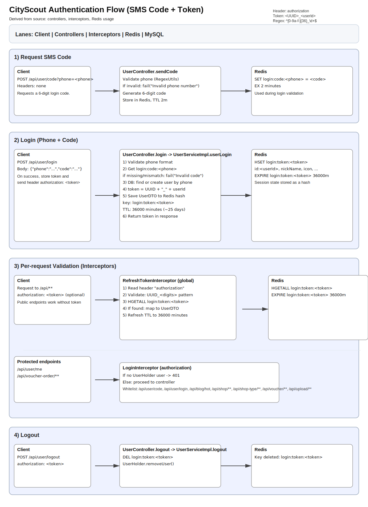

# CityScout

CityScout is a application for a discovery and review platform. It's built with Spring Boot and designed to handle features like user management, business listings, vouchers, and reviews.

## About The Project

This project provides the core backend functionalities for a platform where users can discover local businesses, read and write reviews, and potentially avail offers. Key features include user authentication, shop details, voucher systems, and more, with a focus on performance and scalability through caching and other strategies.

## Tech Stack

- **Backend**: Java 8+, Spring Boot 2.7.x, MyBatis-Plus, Lombok
- **Database**: MySQL 8.0
- **Caching**: Redis 6.2
- **Build Tool**: Maven
- **Containerization**: Docker, Docker Compose
- **Web Server (for static/frontend content via Docker)**: Nginx

## Prerequisites

- JDK 1.8 or higher
- Maven 3.6+
- Docker & Docker Compose (for containerized deployment)
- MySQL Server (if running locally without Docker)
- Redis Server (if running locally without Docker)

## Getting Started

1.  **Clone the repository**:

    ```bash
    git clone <your-repository-url>
    cd CityScout
    ```

2.  **Database Setup (MySQL)**:

    - Ensure your MySQL server is running.
    - Create a database named `hmdp`.
    - Import `hmdp.sql` (found in the project root) into your `hmdp` database.
      ```bash
      # Example command (adjust username as needed)
      mysql -u root -p hmdp < hmdp.sql
      ```
    - Update database credentials in `src/main/resources/application.yaml` if they differ from the defaults (`username: root`, `password: 123456`).

3.  **Redis Setup**:
    - Ensure your Redis server is running.
    - If necessary, update Redis connection details in `src/main/resources/application.yaml` (defaults to `localhost:6379`, no password).

## How to Run

### 1. Locally via Spring Boot

- Make sure your local MySQL and Redis are running and correctly configured in `application.yaml`.
- From the project root, run:
  ```bash
  mvn clean install
  mvn spring-boot:run
  ```
- The application will typically start on port `8081` (configurable in `application.yaml`).

### 2. Using Docker Compose

- This will start the application, MySQL, Redis, and an Nginx server.
- Ensure Docker and Docker Compose are running.
- From the project root, run:
  ```bash
  docker-compose up -d
  ```
- **Services**:

  - **Application Backend**: Port `8081` (default).
  - **MySQL**: Port `3306`.
  - **Redis**: Port `6379`.
  - **Frontend (Nginx)**: Port `8080`, serving files from `./nginx-1.18.0/html/hmdp/`.

- **Database Initialization (Docker)**:
  The MySQL container will create the `hmdp` database. To import your schema and data:

  ```bash
  docker exec -i hm-dianping-mysql mysql -uroot -p123456 hmdp < hmdp.sql
  ```

  (Assumes `hm-dianping-mysql` is your MySQL container name and `123456` is the root password if `MYSQL_ROOT_PASSWORD` env var isn't set in `docker-compose.yml`.)

- **To stop services**:
  ```bash
  docker-compose down
  ```

## Authentication

The backend uses SMS code login with a Redis-backed token session.

- Flow: Request code ➜ Login with code ➜ Get token ➜ Send token in `authorization` header ➜ Interceptors validate and refresh TTL.
- Token format: `<UUID>_<userId>` (example: `550e8400-e29b-41d4-a716-446655440000_12`).
- Header name: `authorization`.
- Redis keys:
  - `login:code:<phone>`: 6-digit code, TTL 2 minutes.
  - `login:token:<token>`: user hash (UserDTO), TTL 36000 minutes (~25 days), refreshed per request.
- Endpoint prefix: all routes are served under `/api` (via `WebConfig`).
- Public endpoints (no token): `/api/user/code`, `/api/user/login`, `/api/blog/hot`, `/api/shop/**`, `/api/shop-type/**`, `/api/voucher/**`, `/api/upload/**`.



## API Examples

- `POST /api/user/login` - User login (returns token)
- `GET /api/shop/{id}` - Get shop details
- `POST /api/voucher-order/seckill/{id}` - Secure a voucher via flash sale

## Contributing

Contributions are welcome! Please submit Pull Requests or open Issues.

## License

(Specify your project's license here, e.g., MIT License, Apache 2.0 License, or leave blank if not specified.)
