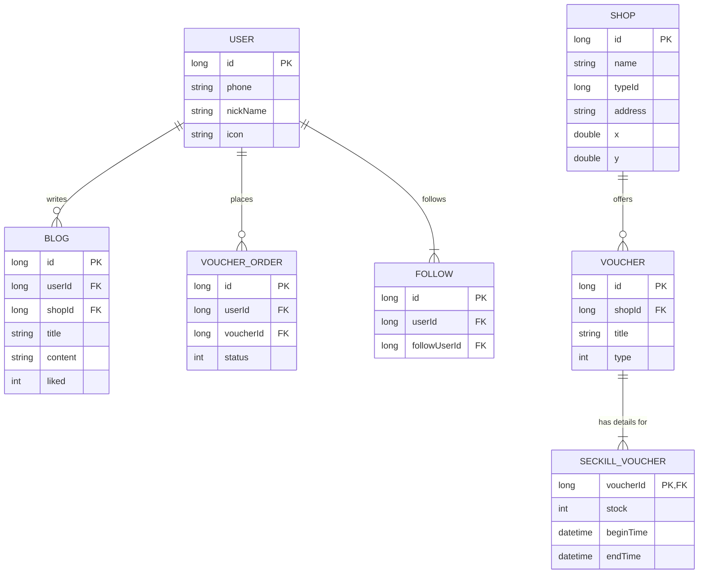

# **CityScout: Technical Overview**

## 1. Introduction

CityScout is a location-based service application designed to help users discover and interact with local shops, share experiences through blogs, and take advantage of promotional offers like seckill vouchers.

The system is built on a modern Java stack, optimized for high performance and scalability, particularly in handling concurrent user requests for features like flash sales. It employs a microservices-inspired approach with a decoupled frontend and backend, using Nginx as a reverse proxy and Redis for extensive caching and high-speed data operations.

**Core Technologies:**
*   **Backend:** Java 11+, Spring Boot
*   **Data Persistence:** MySQL, MyBatis-Plus
*   **Caching & Concurrency:** Redis, Redisson
*   **Frontend:** HTML, CSS, JavaScript (Vue.js)
*   **Web Server / Proxy:** Nginx
*   **Build & Dependency:** Maven
*   **Deployment:** Docker

---

## 2. System Architecture

The application follows a classic decoupled architecture, ensuring separation of concerns between the user interface and backend business logic.

### Component Diagram

This diagram illustrates the high-level components and their interactions.

```mermaid
graph TD
    subgraph "User's Browser"
        Frontend[Vue.js Frontend]
    end

    subgraph "Server Infrastructure"
        Nginx[Nginx Web Server]
        Backend[Backend API <br> (Spring Boot)]
        Redis[Redis <br> (Cache, Locks, Queues)]
        MySQL[MySQL Database]
    end

    Frontend -- HTTP/S Requests --> Nginx
    Nginx -- /api --> Backend
    Nginx -- / --> Frontend
    Backend <--> Redis
    Backend <--> MySQL

    style Frontend fill:#cde4ff
    style Nginx fill:#9f9,stroke:#333,stroke-width:2px
    style Backend fill:#f9f,stroke:#333,stroke-width:2px
    style Redis fill:#ff9,stroke:#333,stroke-width:2px
    style MySQL fill:#f96,stroke:#333,stroke-width:2px
```

*   **Frontend:** A single-page application (SPA) built with Vue.js that runs in the user's browser.
*   **Nginx:** Acts as a reverse proxy. It serves the static frontend files and forwards all API requests (`/api/*`) to the Spring Boot backend.
*   **Backend API:** The core of the application. A Spring Boot service that handles all business logic, data processing, and authentication.
*   **Redis:** A critical component used for multiple purposes:
    *   **Caching:** Caching frequently accessed data (e.g., shop details, user sessions) to reduce database load.
    *   **Distributed Locks:** (Using Redisson) To manage concurrency in critical sections.
    *   **High-Speed Operations:** For features like "likes" and "follows" using Sets, and location-based searches using GEO commands.
    *   **Atomic Operations:** Using Lua scripts for the seckill voucher functionality to ensure atomicity.
*   **MySQL:** The primary relational database for storing core data like user profiles, shop information, and orders.

---

## 3. Core Functionalities & UML Diagrams

### Use Case Diagram

This diagram shows the main actions a user can perform within the system.

```mermaid
actor User
rectangle CityScout {
  User -- (Login / Register)
  User -- (Browse Shops)
  User -- (Search by Type/Location)
  User -- (View Blog Posts)
  User -- (Create/Like Blog Post)
  User -- (Follow Other Users)
  User -- (Claim Seckill Voucher)
}
```

### Deep Dive: Seckill Voucher System

This is one of the most critical features, designed to handle high concurrency during flash sales. The system uses an asynchronous, Redis-based approach to ensure performance and consistency without overwhelming the database.

The recent optimization switched from a simple distributed lock to a more advanced Lua script and a blocking queue, significantly improving throughput.

#### Seckill Order Sequence Diagram

This diagram details the optimized flow for creating a seckill voucher order.

```mermaid
sequenceDiagram
    participant User
    participant VoucherOrderController
    participant Redis (Lua Script)
    participant OrderQueue (BlockingQueue)
    participant VoucherOrderHandler (Async)
    participant Database

    User->>+VoucherOrderController: POST /voucher-order/seckill/{id}
    VoucherOrderController->>+Redis (Lua Script): EXECUTE seckill.lua (voucherId, userId)
    Note right of Redis (Lua Script): Atomically: <br>1. Check stock > 0 <br>2. Check if user already ordered <br>3. Decrement stock <br>4. Add user to order set
    Redis (Lua Script)-->>-VoucherOrderController: Return status (0: OK, 1: No Stock, 2: Already Ordered)
    alt Success (status == 0)
        VoucherOrderController->>OrderQueue (BlockingQueue): Add new VoucherOrder DTO
        VoucherOrderController-->>-User: HTTP 200 OK (Order ID)
        loop Asynchronous Processing
            VoucherOrderHandler (Async)->>+OrderQueue (BlockingQueue): take()
            VoucherOrderHandler (Async)->>+Database: Create VoucherOrder record
            Database-->>-VoucherOrderHandler (Async): Confirm save
            VoucherOrderHandler (Async)-->>-OrderQueue (BlockingQueue):
        end
    else Failure
        VoucherOrderController-->>-User: HTTP 400 Bad Request (Error Msg)
    end
```

**Key benefits of this design:**
1.  **High Performance:** The initial user request is handled entirely by Redis, which is extremely fast. The user gets an immediate response.
2.  **Database Protection:** The database is not hit by the initial wave of concurrent requests. Orders are created asynchronously and sequentially by a single-threaded executor, preventing deadlocks and race conditions at the DB level.
3.  **Atomicity:** The Lua script ensures that checking stock, checking user history, and updating stock are performed as a single, indivisible operation.

---

## 4. Data Model (Entity-Relationship Diagram)

This diagram shows the main data entities and their relationships.



---

## 5. Key Design Patterns & Decisions

*   **Cache-Aside Pattern:** The primary caching strategy. The application logic first checks Redis for data; if it's a cache miss, it queries the database and then populates the cache.
*   **Handling Cache Issues:**
    *   **Cache Penetration:** For non-existent data (e.g., `shopId = -1`), empty objects are cached for a short duration to prevent repeated database queries for invalid keys.
    *   **Cache Breakdown/Stampede:** For hot keys, a **mutex lock** (via Redisson) is used during a cache miss. Only one thread rebuilds the cache, while others wait, preventing a "dogpile" effect on the database. For some data, **logical expiration** is used, where old data is served while a background thread refreshes it.
*   **Asynchronous Processing:** The seckill order system uses a `BlockingQueue` and a dedicated `ExecutorService` to decouple the initial request from the final database write, maximizing responsiveness and system stability under load.
*   **Redis for Performance-Critical Features:**
    *   **Likes/Follows:** Implemented using Redis Sets (`SADD`, `SREM`, `SISMEMBER`) for O(1) complexity, which is much faster than database queries.
    *   **Location Search:** Uses Redis's `GEO` data structures (`GEOADD`, `GEOSEARCH`) to efficiently find nearby shops.